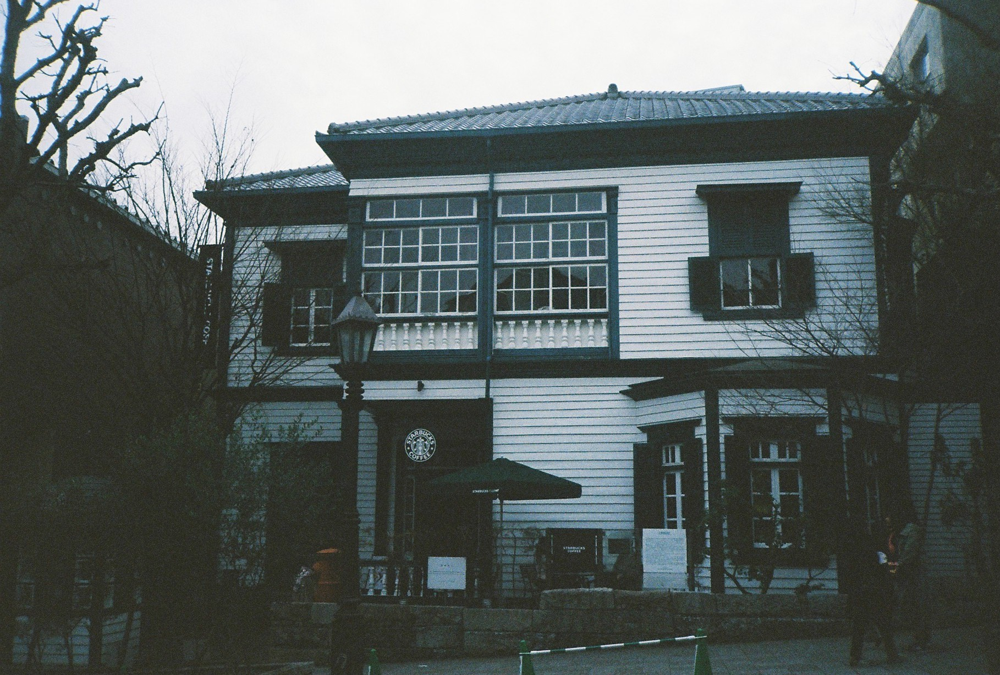

README.md 설명서
===============

## 1. repository 이름: Team 4

## 2. 조이름: 융복합 프로젝트형 빅데이터 분석 서비스 개발 교육 4조

## 3. 조인원: 김승열, 김주희 (총 2명)

## 4. 작업 내역
### 1) 김승열
* 4조원들이 각자 Branch를 만들어   
4개의 폴더(사진, 음악, 문서 그리고 자기소개서)를 만들어 이를 병합하였고   
이후 충돌부분은 협의하여 직접 해결하였습니다. 

### 2) 김주희
* GitHub repository "Team4" 생성
* GitHub 특강 MS-Excel URL 공유
* team-mission branch 생성
	- README.md 수정, 커밋, 푸쉬 3회 반복 -> 채팅
* team-mission branch와 origin branch를 merge
	- merge 후, 생생된 충돌 오류을 editor로 직접 수정 해결
* origin branch와 main branch를 merge
	- merge 후, 생생된 충돌 오류을 editor로 직접 수정 해결
* 김주희 branch 생성
	- "문서", "사진", "음악", "자기 소개" 폴더 생성
	- "영어회화.docx", "000009.jpg", "000017.jpg", "000021.jpg", "가을방학-3X4-가을방학.mp3", "가을방학-색노랑과 새빨강 사이-가을방학.mp3", "김동률-내 사람.mp3", "김동률-오래된 노래.mp3", "자기소개_김주희.pptx" 파일 업로드
	- 'README.md' 수정
		+ 'README.md 제목' 생성
		+ '1. repository 이름' 생성
		+ '2. 조이름' 생성
		+ '3. 조인원' 생성
		+ '4. 작업 내역' 중 '2) 김주희' contents 생성
		+ 채팅 내역 순서 재정렬하여 '7. 채팅' contents로 정리
		+ '6. 작업 내역' 중 '2) 김주희' contents 생성
            
## 5. 문서

### 1) 사진
#### 김승열

* 공원에서 신문을 보면서 휴식을 취하며
    
#### 김주희

### 2) 음악
#### 김승열
* 음악/조용한피아노곡.mp3
	- 조용한 피아노 음악곡을 올리고

#### 김주희
* 음악/가을방학-3X4-가을방학.mp3
* 음악/가을방학-샛노랑과 새빨강 사이-가을방학.mp3
* 음악/김동률-내 사람.mp3
* 음악/김동률-오래된 노래.mp3

### 3) 문서
#### 김승열
* 이력서/이력서.pptx
	- 현재 코딩공부하는 것에 집중하는 이력서를 준비
        
#### 김주희
* 문서/영어회화.docx
    
### 4) 폰트
#### 김승열
* 폰트/국영문폰트.ttf
    
### 5) 자기 소개
#### 김승열
* 이력서/이력서.pptx
	- 김승열 조원은 아주 간단하게 정리하는 것에 초점을 두어  
        
#### 김주희
* 자기소개/자기소개_김주희.pptx

## 6. 소감 작성
### 1) 김승열: 코딩공부를 하면서 좀더 많은 지식과 경험을 가지게 되었습니다. 
### 2) 김주희: 너무 재밌었습니다 :)!

## 7. 채팅
>##### 김승열 
>* 안녕하세요? 김승열입니다.
>
>>##### 김주희
>>* 안녕하세요 4조 맥유저분들!
>>* 사양이 어찌됬던 맥으로 끝까지 깃허브 정복해봐요!
>>* we can do anything, even if it's impossible!
>>> 
>>>##### 김승열
>>>* 2번째입니다.
>>> 
>>>>##### 김주희
>>>>* 네, 반갑습니다 저희 교육 끝까지 잘 공부해봐요! :)
>>>>
>>>>>##### 김승열
>>>>>* 3번째입니다.
>>>>>
>>>>>>##### 김주희
>>>>>>* 미션 수행 완료입니다!
>>>>>>>##### 김승열
>>>>>>>* 수고하셨습니다. 특히 김주희 조원님께서
>>>>>>>수고를 많이 해주셔서 배우는 기회가 되었습니다. 감사합니다!
>>>>>>>>##### 김주희
>>>>>>>>* 수고하셨습니다! 저도 배울 수 있어 좋은 기회였습니다! 화이팅!
